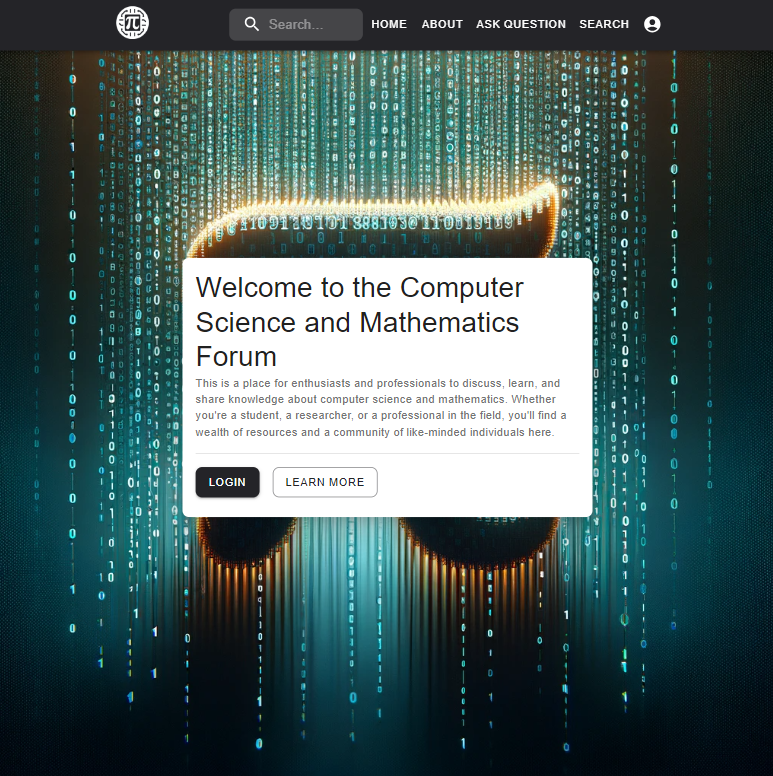
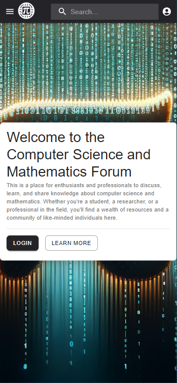
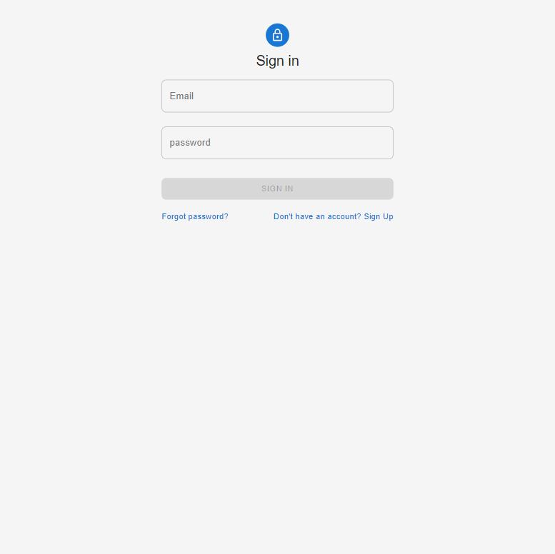
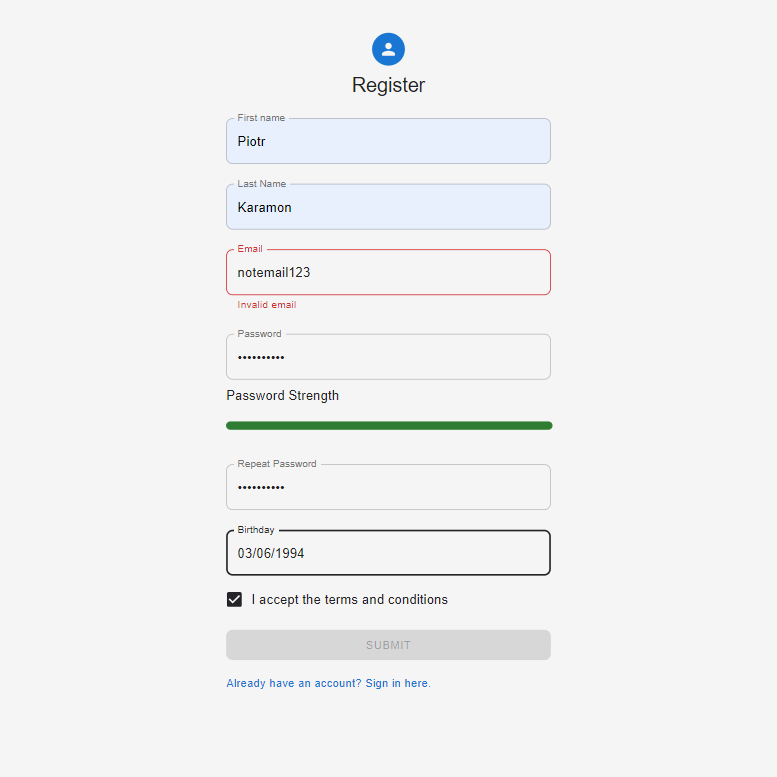
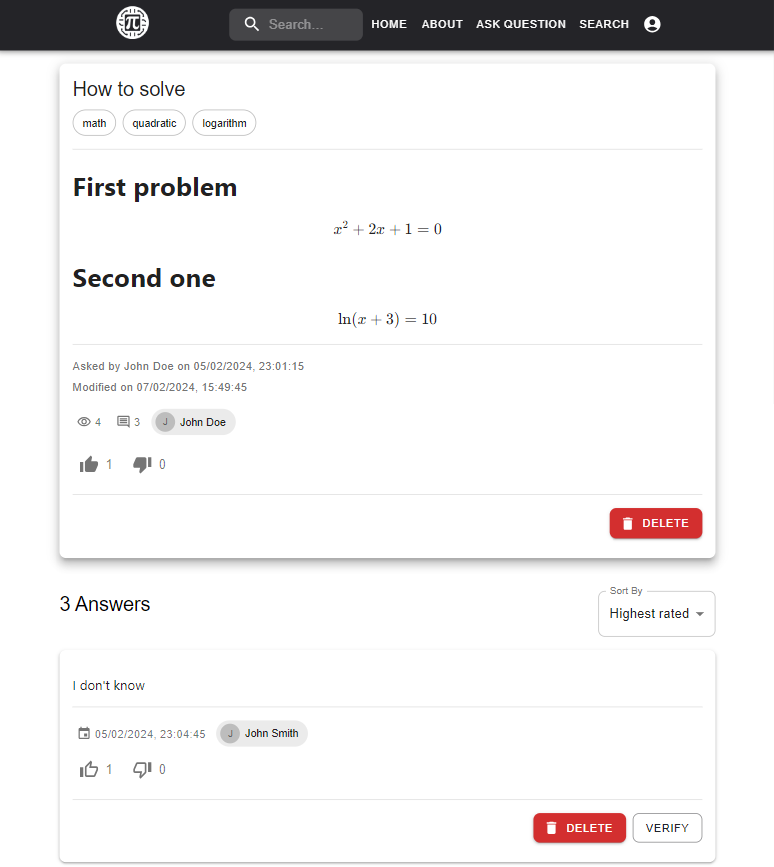
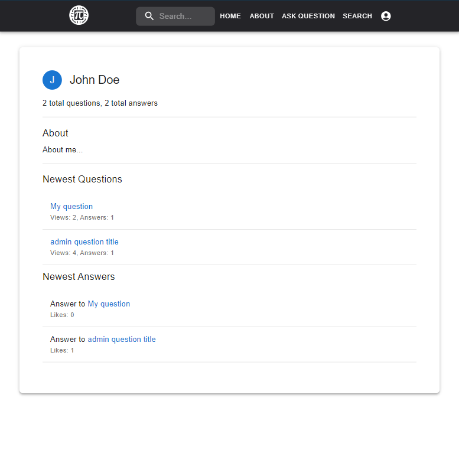
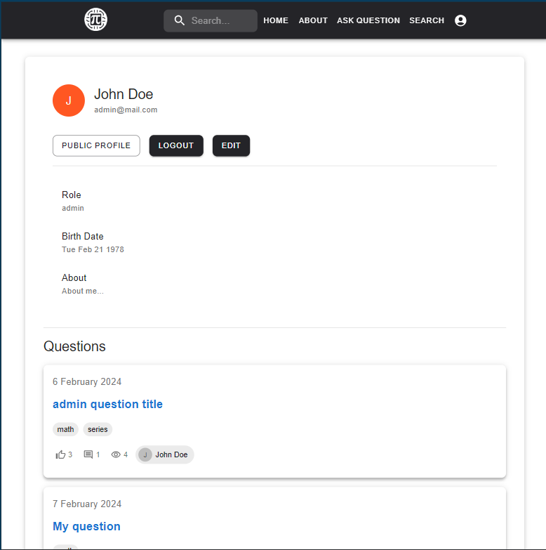
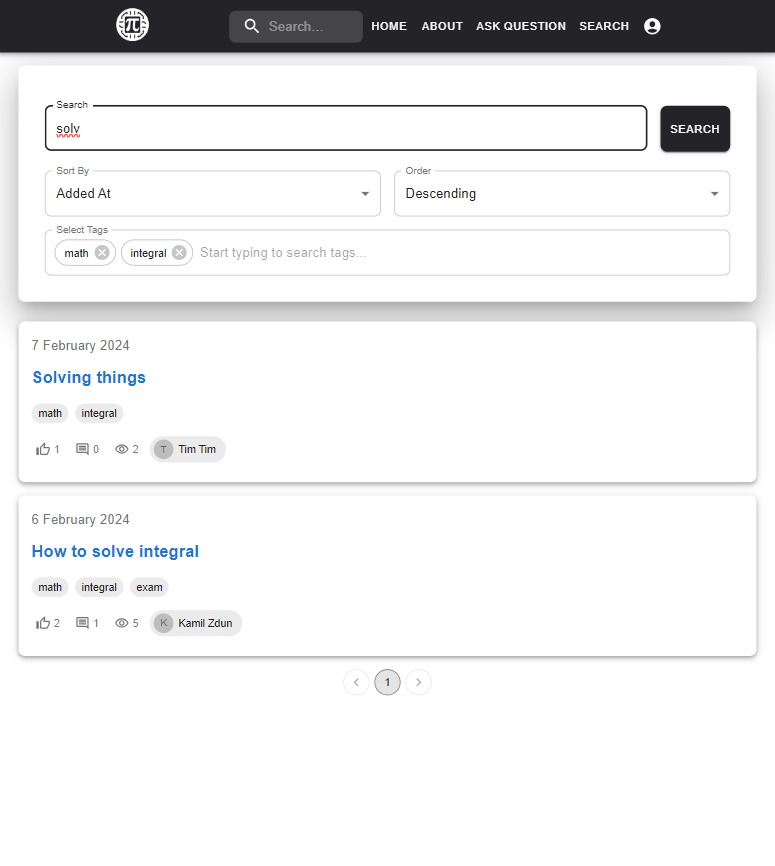

# Math CS Forum 📐💻 Project  Overview

**Math CS Forum**—a community platform designed for enthusiasts, students, and professionals in mathematics and
computer science.
This forum was build as the final project for the Introduction to Web Applications course on AGH UST.
The project is composed of two parts:
- **Frontend** - a React application that provides the user interface for the forum.
- **Backend** - a Python application that provides the API for the frontend.

## 🤝 Our Team

This project was created by a team of three students from AGH UST:
- **Piotr Karamon** - *leader and frontend*
- **Maksymilian Kowalski** - *backend*
- **Łukasz Zegar** - *backend*

## 🚀 Features

- **Interactive Q&A System** 🗣️: The forum allows users to ask questions, provide answers, and engage in discussions on a wide range of topics in mathematics and computer science.
- **Elegant User Interface** 🎨: Crafted with Material UI, our forum offers an intuitive user experience, making navigation and interaction easy on all devices.
- **User Profile** 👤: Users can create accounts, log in, and manage their data, see their questions and answers.
- **Search Functionality** 🔍: Users can search for questions by keywords, tags, and sort results by various properties, making it easy to find the information they need.
- **Tagging System** 🏷️: Questions can be tagged with relevant topics, making it easier for users to find questions and answers on specific subjects.
- **Answer Verification** ✅: Admins can verify answers to questions, making it easier for others to find the most helpful responses.
- **Question and Answer Rating System** 👍👎: Users can upvote or downvote questions and answers, thus signaling their quality/usefulness to other users.

## 📸 Interface Highlights

Here's a sneak peek into our platform's main features. Add your screenshots or visual representations below to guide the viewer through your project's capabilities.

### Homepage

### Homepage on phone

### Login page

### Register page

### Question page

### Public profile

### Private profile

### Search

## 📜 License

The Math CS Forum is open source under the MIT license.

